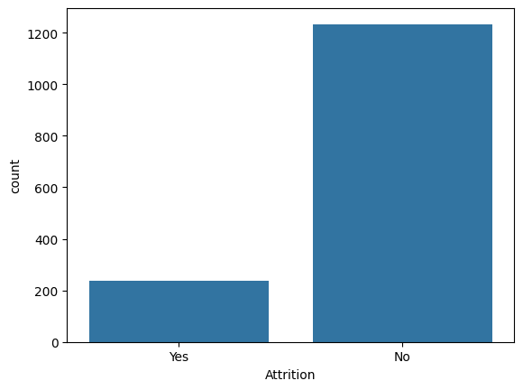
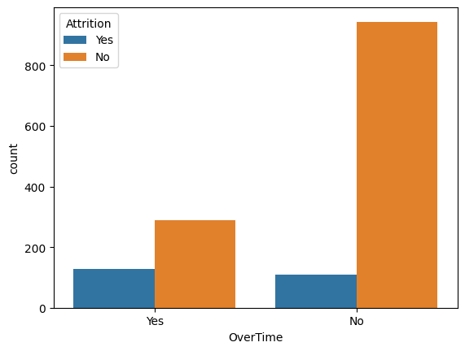
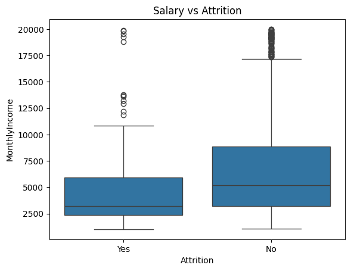
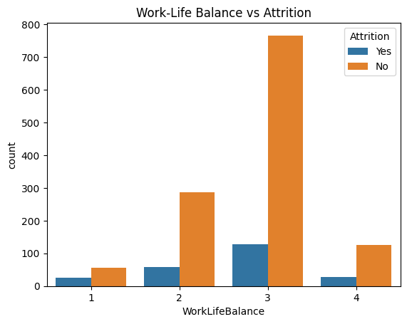
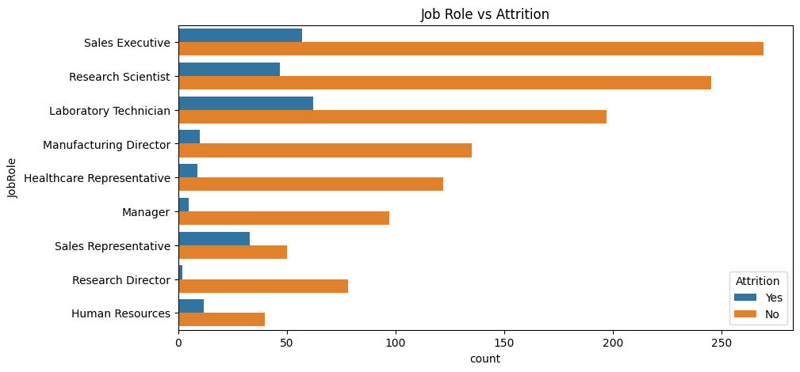
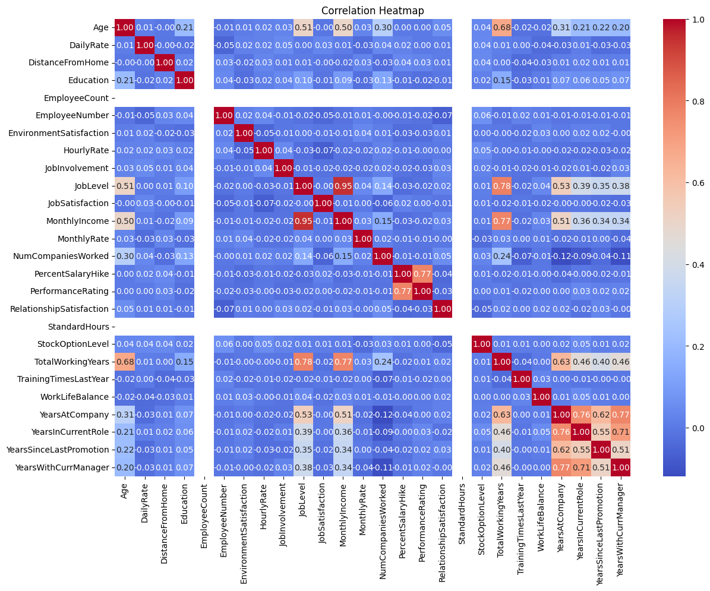

# IBM HR Analytics – Employee Attrition Analysis

## Project Overview
This project performs Exploratory Data Analysis (EDA) on the IBM HR Analytics dataset to understand the key factors affecting employee attrition.  
The goal is to identify patterns in employee behavior and provide insights that can help improve employee retention.

---

## Tools and Technologies Used
- Python  
- Pandas  
- NumPy  
- Matplotlib  
- Seaborn  
- SQL  

---

## Key Analysis Performed
- Attrition rate calculation  
- Salary vs Attrition analysis  
- Overtime impact on attrition  
- Work-life balance analysis  
- Job role and department-wise attrition  
- Experience and promotion-based analysis  
- Correlation analysis  

---

## Visualizations

### Attrition Count


### Overtime vs Attrition


### Salary vs Attrition


### Work-Life Balance vs Attrition


### Job Role vs Attrition


### Correlation Heatmap


---

## Key Business Insights
- Around 16% of employees leave the company, indicating moderate attrition.  
- Employees who work overtime are more likely to leave, suggesting workload-related issues.  
- Employees with lower salaries tend to leave more, indicating compensation concerns.  
- Poor work-life balance increases the likelihood of attrition.  
- Employees tend to leave more in their early years at the company.  
- Lack of promotions contributes to higher employee turnover.  
- Certain job roles and departments show higher attrition levels.  

---

## Conclusion
The analysis shows that employee attrition is influenced by multiple factors such as salary, overtime, job satisfaction, and promotion opportunities.  
Improving these areas can help reduce employee turnover and enhance overall employee retention.

---

## Repository Structure

```
IBM-HR-Attrition-Analysis/
|
|-- IBM_HR_EDA.ipynb
|-- IBM_SQL_Analysis.sql
|-- README.md
|-- images/
    |-- attrition_count.png
    |-- overtime_attrition.png
    |-- salary_attrition.png
    |-- worklife_attrition.png
    |-- jobrole_attrition.png
    |-- correlation_heatmap.png
```

## Author
Soham Chavan
